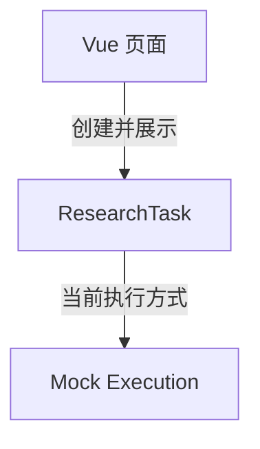
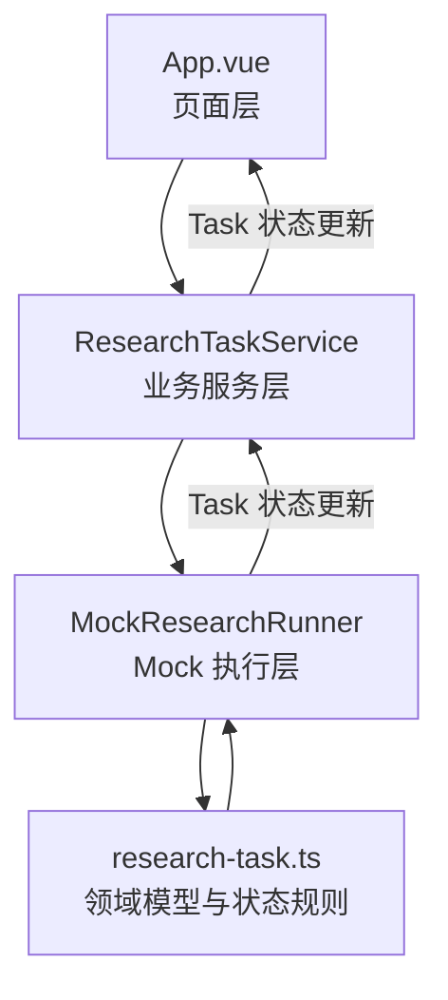
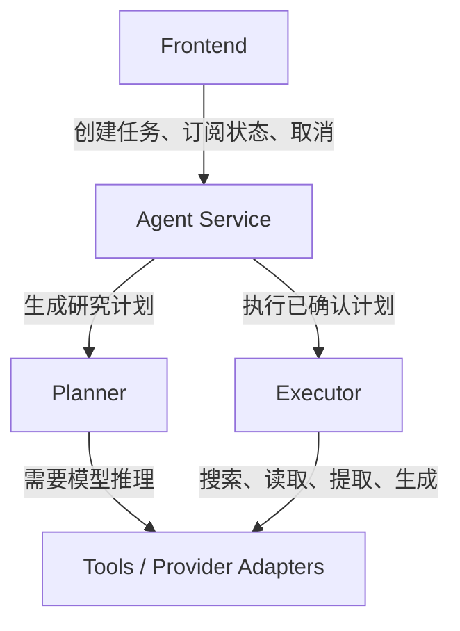

# Deep Research Agent 架构地图

> 状态：设计记录
>
> 适用阶段：当前前端本地 Mock Research Task，以及未来接入真实 Agent 能力时的渐进式演化。
>
> 本文记录职责边界和可能的目录规划，不改变 [`product-spec.md`](./product-spec.md) 中的当前产品范围，也不表示真实 LLM、搜索、后端或 Multi-Agent 已经实现。

## 1. 当前架构

当前产品视角可以简化为：



当前代码已经存在一层较薄的业务协调边界，实际依赖关系为：



各部分当前职责：

| 当前代码 | 当前职责 |
| --- | --- |
| `App.vue` | 接收 Research Question、维护页面响应式状态、调用服务、展示 Task/Plan/Step 与错误、页面卸载时释放运行资源。 |
| `research-task-service.ts` | 校验任务是否可以开始、替换旧运行、阻止迟到事件覆盖新任务、统一释放当前运行。 |
| `mock-research-runner.ts` | 解析仅开发/测试可用的 Mock 标记，通过计时器推进任务，并模拟 planning 或 researching 期间的失败与取消。 |
| `research-task.ts` | 定义 Research Task、Plan、Step、错误和状态类型，维护合法转换与串行步骤规则；当前也暂时保存固定 Mock Plan 创建逻辑。 |

当前没有真实 Agent Service、Planner、Executor 或 Tools。Mock 定时推进不能被描述成真实搜索、核验或报告生成能力。

## 2. 未来目标架构

未来接入真实能力后的主链路计划为：



目标边界：

- **Frontend**：只负责用户交互和状态展示，不直接持有 LLM Key，不直接调用模型或搜索工具。
- **Agent Service**：承接研究用例，协调 Task 生命周期、Planner、Executor、取消、错误转换和状态事件。
- **Planner**：根据规范化问题生成结构化 Research Plan，并在边界处验证输出；不负责页面展示。
- **Executor**：按合法状态规则执行 Steps，记录 Source 与 Evidence，处理超时、取消和可重试错误。
- **Tools**：封装 LLM、搜索、网页读取等外部能力；返回值按不可信输入处理，不直接改写领域状态。
- **Domain**：继续保存实体、状态和不变量，不依赖 Vue、HTTP、具体模型 SDK、计时器或数据库。

真实 LLM 接入必须经过服务端或受控服务边界，不能把 API Key 或 Provider SDK 直接放进浏览器页面。

## 3. 当前代码职责检查

### 3.1 应继续留在 `App.vue`

- Research Question 的输入绑定。
- 提交按钮的可用状态。
- 调用业务服务开始研究。
- 接收并保存最新的 `ResearchTask` 页面快照。
- 展示 idle、Task 状态、结构化错误、Plan 和 Step 状态。
- 页面卸载时调用服务的 `dispose`。
- 只与用户可观察行为有关的文案和可访问性属性。

以下逻辑不应重新放回 `App.vue`：

- Mock 标记解析和优先级。
- `setTimeout` 驱动的任务推进。
- 合法状态转换和 Step 串行规则。
- LLM Prompt、模型选择、搜索调用和 Provider 错误处理。
- 数据持久化、重试策略和 Agent 工具权限。

### 3.2 未来属于 `services/`

- `ResearchTaskService` 和面向页面的研究用例。
- Runner/Agent 的调用契约。
- 创建、取消、重试或恢复 Research Task 的应用级协调。
- 把 Agent 或 Provider 错误转换为领域错误。
- 防止旧运行事件覆盖新任务的并发保护。
- 未来对 Repository、Agent Runner 和状态事件的协调。

当前只有一个服务文件，暂时保留在 `src/` 根目录。出现真实 Runner、第二个业务用例或多个服务文件时，再整体迁入 `services/`。

### 3.3 未来属于 `domain/`

- `ResearchTask`、`ResearchPlan`、`ResearchStep`、`Source`、`Evidence` 和 `Report` 等领域类型。
- Task 与 Step 的独立状态类型。
- 合法状态转换、终态关闭、Plan 关联和 Citation 可追溯等不变量。
- 不依赖外部时间、随机 ID、Vue、网络或模型 SDK 的纯函数。

`research-task.ts` 当前仍可作为单一领域文件。只有在 Source/Evidence/Report 开始实现，或不同领域概念已经可以独立测试和演化时，才迁入 `domain/` 并按概念拆分。

### 3.4 未来属于 `agent/`

- `MockResearchRunner` 及其开发测试标记。
- 固定 Mock Plan 模板、Mock ID 和定时推进机制。
- 真实 `Planner`、`Executor` 与执行事件协议。
- LLM、搜索、网页读取和内容提取工具适配器。
- Prompt 版本、模型配置、Token/成本/延迟记录。
- 超时、取消和受控重试策略。

当前 `research-task.ts` 中以 `Mock` 命名的创建与推进函数可以在真实 Runner 出现时迁入 `agent/mock/`；合法状态转换继续保留在领域层。今天不为了目录形式提前移动。

### 3.5 未来属于 `components/` 和 `utils/`

`components/` 只承载具有独立展示职责或可复用价值的 UI，例如：

- `ResearchQuestionForm`
- `ResearchTaskStatus`
- `ResearchPlanView`
- `ResearchStepList`

当前页面规模仍小，不需要立即拆组件。

`utils/` 只放与业务无关、被多个模块复用的通用纯函数。领域转换、Prompt、错误规则和 Mock 协议不能为了方便被放进 `utils/`。当前没有必须创建的通用工具模块。

## 4. 未来目录规划

当对应职责实际出现后，`apps/web/src/` 可能逐步演化为：

```text
src/
├── domain/       # 领域类型、状态转换与不变量
├── services/     # 页面用例与 Agent/Repository 协调
├── agent/        # Mock/真实 Runner、Planner、Executor 与 Tools
├── components/   # 可独立验证或复用的 Vue 展示组件
├── utils/        # 少量跨模块、无业务含义的通用纯函数
├── App.vue       # 页面组合与顶层展示
└── main.ts       # Vue 应用入口
```

这是一份方向图，不是要求立即创建的目录树。目录只有在出现真实文件和明确职责时才创建，禁止建立空目录或空壳抽象。

## 5. 最小演进顺序

1. 当前继续保持单页面、本地 Mock 和单一 Research Task。
2. 实现 Source、Evidence 或 Report 时，先在领域层补充类型、不变量和测试。
3. 出现真实执行实现时，将 Mock Runner 与真实 Runner 放入 `agent/`，并保持共同的服务调用边界。
4. 首次真实 LLM 接入只替换 Planner，结构化输出必须经过运行时校验；Step 执行仍可保持 Mock。
5. 再逐步实现单一串行 Executor、搜索/读取 Tools、Source/Evidence 和 Citation 校验。
6. 只有长时间运行、页面刷新恢复或后台执行成为产品要求时，才引入持久化和任务队列。
7. 单一研究流程通过测试和 Eval 后，才考虑 Multi-Agent 编排。

每一步涉及状态、转换、数据模型或触发方式变化时，必须先同步 Product Spec，再修改实现和测试。

## 6. 今日明确不做

- 不移动当前源码目录。
- 不创建 `domain/`、`services/`、`agent/`、`components/` 或 `utils/` 空目录。
- 不增加 Router、全局状态库、依赖注入框架或 UI Library。
- 不创建虚假后端接口。
- 不接入 LLM、搜索、数据库或持久化。
- 不提前实现 Multi-Agent、并行步骤、任务队列或 Evaluation Lab 平台。
