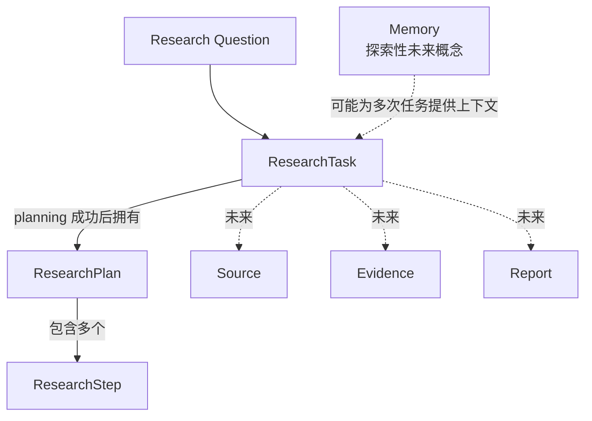
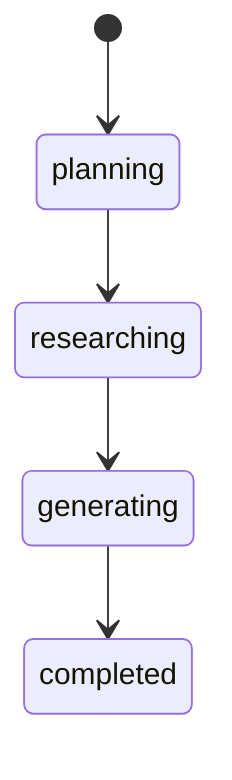

# Deep Research Agent 领域模型

> 状态：业务地图
>
> 本文描述当前 Deep Research Agent 的领域概念、职责、状态和业务规则，不是代码设计或数据库 Schema。
>
> 当前行为仍以 [`product-spec.md`](./product-spec.md) 为准；未来分层方向参见 [`architecture.md`](./architecture.md)。本文不会把未来候选状态或对象描述成已经实现的能力。

## 1. 领域边界

当前切片处理的核心业务是：用户从一个 Research Question 创建一次 Research Task，看到 Research Plan，并观察 Research Steps 按顺序推进。



当前可以把 `ResearchTask` 视为聚合入口：Plan 与 Steps 的变化必须符合 Task 生命周期，不应由页面或外部工具任意改写。

## 2. 当前核心领域概念

### 2.1 ResearchTask

**职责**

代表一次研究任务，保存用户要研究的问题，并描述这次任务当前处于生命周期的哪个阶段。

**当前字段及含义**

| 字段 | 领域含义 |
| --- | --- |
| `id` | 一次 Research Task 的稳定身份。 |
| `question` | 去除首尾空白后的真实研究问题，不包含本地 Mock 控制标记。 |
| `status` | Task 当前生命周期状态。 |
| `createdAt` | Task 创建时间，属于任务业务记录；具体时间由领域外提供。 |
| `plan` | planning 成功后产生的唯一 Research Plan；不同状态下是否存在由领域规则约束。 |
| `error` | Task 失败时的结构化错误，包含 `code`、`message` 和 `retryable`。 |

**当前状态**

```text
planning
researching
generating
completed
failed
cancelled
```

**当前成功路径**



任何进行中状态都可以按照已声明规则进入 `failed` 或 `cancelled`。

**规则**

- `completed`、`failed` 和 `cancelled` 是终态，终态不可恢复或继续推进。
- `planning` Task 尚无 Plan。
- `researching`、`generating` 和 `completed` Task 必须拥有与自身 `id` 匹配的 Plan。
- planning 期间失败或取消时可以没有 Plan。
- researching 或 generating 期间失败或取消时可以保留已有 Plan 和 Step 快照。
- 进入 `failed` 时必须携带结构化错误。
- Task 状态不能绕过合法转换直接改写。

### 2.2 ResearchPlan

**职责**

描述一次 Research Task 准备执行的研究路径，将较大的 Research Question 拆成多个可观察的 Research Steps。

**当前字段及含义**

| 字段 | 领域含义 |
| --- | --- |
| `id` | 一个 Plan 的稳定身份。 |
| `taskId` | Plan 所属 Research Task 的身份。 |
| `steps` | 按执行顺序排列的 Research Steps。 |

**规则**

- planning 成功后，一个 Task 获得一个且仅一个 Plan。
- `taskId` 必须与所属 Task 的 `id` 一致。
- Plan 包含多个 Research Steps；当前固定 Mock 模板恰好包含 3 个。
- 每个 Task 创建新的 Plan ID 和 Step IDs。
- Plan 创建时所有 Steps 都从 `pending` 开始。
- Plan 描述研究路径，不负责调用 LLM、搜索或工具。

### 2.3 ResearchStep

**职责**

描述研究路径中的一个研究动作，例如明确范围、收集核验资料或整理结论。Step 同时保存该动作当前的离散执行状态。

**当前字段及含义**

| 字段 | 领域含义 |
| --- | --- |
| `id` | Step 在 Plan 内的稳定身份。 |
| `title` | 面向用户的研究动作名称。 |
| `description` | 研究动作的目标和边界。 |
| `status` | Step 当前执行状态。 |

**当前合法状态**

```text
pending
running
completed
```

**未来候选状态，当前暂不实现**

```text
failed
skipped
```

`failed` 和 `skipped` 目前不是 `ResearchStepStatus` 的合法值。引入它们之前必须先在 Product Spec 中确认失败传播、是否允许重试、后续 Step 是否继续、Task 如何转换以及用户如何理解跳过原因。

**规则**

- 当前只允许 `pending → running → completed`。
- 当前 Steps 按 Plan 顺序串行执行。
- 同一 Research Task 在任一时刻最多只有一个 Step 为 `running`。
- 当前 Step 完成后，下一个 `pending` Step 才能进入 `running`。
- 全部 Steps 完成后，Task 才能从 `researching` 进入 `generating`。
- Task 进入 `failed` 或 `cancelled` 后，已有 Step 状态冻结。

### 2.4 ResearchTaskError

**职责**

描述 Task 失败的业务可观察结果，使页面和未来服务能够区分错误原因和是否适合重试。

**当前字段**

- `code`：稳定、可判断的错误代码。
- `message`：面向当前用户的错误说明。
- `retryable`：该失败是否具备重试可能；不等于系统当前已经提供重试功能。

Provider 原始异常、堆栈、HTTP Response 和密钥等技术信息不属于该领域对象。

## 3. 哪些字段属于领域状态

领域状态是能够表达 Research Task 业务事实，并受到业务规则约束的数据。

| 概念 | 当前领域状态 | 说明 |
| --- | --- | --- |
| ResearchTask | `id`、`question`、`status`、`createdAt`、`plan`、`error` | 身份、研究目标、生命周期和结果快照。 |
| ResearchPlan | `id`、`taskId`、`steps` | Task 与研究路径的关联。 |
| ResearchStep | `id`、`title`、`description`、`status` | 单个研究动作及其离散状态。 |
| ResearchTaskError | `code`、`message`、`retryable` | 失败状态的结构化业务信息。 |

以下内容不是领域状态：

- Vue `ref`、computed 值和 DOM 展示状态。
- `idle` 页面状态；它表示当前没有 Task，不是 ResearchTask 状态。
- 中文状态标签、按钮禁用状态和 CSS class。
- `[mock:*]` 标记及其优先级。
- Timer ID、`runVersion` 和页面卸载清理标志。
- LLM Provider、模型名、Prompt 文本、API Key、HTTP 请求或 SDK Response。
- 测试用 fake timers 和测试选择器。

## 4. 不应该放在领域模型中的逻辑

| 逻辑 | 应属于 |
| --- | --- |
| 表单输入绑定、按钮状态和页面渲染 | UI/Page |
| 页面没有 Task 时显示 `idle` | UI/Page |
| Mock 标记解析、Mock 失败优先级 | Mock Agent/测试适配器 |
| `setTimeout` 推进和 Timer 清理 | Mock Agent 执行层 |
| 替换旧运行、忽略迟到事件、释放运行资源 | 业务服务层 |
| 调用 LLM、搜索、网页读取和内容提取 | Agent/Tools |
| Prompt 模板、模型配置、Token 和成本记录 | Agent/可观测层 |
| 数据库读写、网络重试和序列化 | 基础设施层 |
| 状态中文标签和国际化 | 展示层 |

领域模型应该表达“什么转换合法”和“什么业务事实成立”，不应该负责“用哪个技术执行”或“如何显示”。

## 5. 当前 UI 与业务混合情况

当前代码经过最小边界拆分后，`App.vue` 已主要保留页面职责，混合程度不高。仍有几个可以观察、但暂时不需要处理的边界：

1. `App.vue` 仍直接组合具体 `MockResearchRunner`。当前只有一种执行实现，这可以作为页面级 Composition Root；真实 Runner 出现后再把选择逻辑移到应用启动或配置边界。
2. Task 与 Step 的中文状态标签仍与领域类型放在 `research-task.ts`。当前这样可以避免状态表漂移；只有出现多语言或多个展示端时才需要移动到展示层。
3. `ResearchRunner.normalizeQuestion` 同时服务按钮校验和 Mock 标记移除。当前可以保持简单；真实 Agent 接入时，应区分正式问题规范化与仅开发环境使用的 Mock 输入解析。
4. `research-task.ts` 同时包含领域转换和以 `Mock` 命名的创建/推进函数。这不是 UI 混合，但属于领域与 Mock 执行实现的暂时共置；真实 Runner 出现时再分离。
5. `App.spec.ts` 同时包含组件行为和领域函数测试。当前测试规模仍可管理；新增独立领域模块或 Agent 模块时再按职责拆分。

这些问题目前都没有要求大规模重构，也不影响当前本地 Mock 生命周期的可验证性。

## 6. 真实 Agent 接入后需要保留的领域对象

以下对象和规则不依赖 Mock，应继续保留：

- **ResearchTask**：仍代表一次研究任务，是生命周期与研究结果的业务入口。
- **ResearchPlan**：仍描述研究路径，但内容将由真实 Planner 生成并通过运行时校验。
- **ResearchStep**：仍描述可观察的研究动作，由 Executor 推进状态。
- **ResearchTaskError**：继续提供稳定错误代码、用户信息和重试语义。
- **Task/Step 状态类型**：继续保持相互独立。
- **合法转换与不变量**：终态关闭、Plan 归属、最多一个 running Step、完成条件等继续有效。

需要替换的是执行方式，而不是这些领域对象：固定模板和 Timer Runner 可以被真实 Planner/Executor 替代，页面仍消费 ResearchTask 快照或状态事件。

## 7. 未来概念，暂不实现

### 7.1 Source

**未来职责**

代表系统实际读取过的外部来源，为 Evidence 和 Citation 提供可追溯依据。未来可能包含 `id`、URL、标题、读取内容、读取时间和内容指纹。

**现在不实现的原因**

当前没有真实搜索和内容读取。创建虚假 Source 会暗示系统已经访问真实来源，违背当前产品范围。

### 7.2 Evidence

**未来职责**

代表由明确 Source 支持或反驳的事实、引文或判断依据，并通过 `sourceId` 回溯到来源。

**现在不实现的原因**

当前没有真实 Source，也没有证据提取和交叉核验过程。脱离实际来源创建 Evidence 没有可信业务含义。

### 7.3 Report

**未来职责**

代表最终研究结果，包括摘要、正文结构、结论和 Citations。关键结论必须能定位到实际读取的 Source。

**现在不实现的原因**

当前流程只验证 Plan 与 Step 状态，没有真实研究内容、Evidence 或 Citation，无法生成可信报告。

### 7.4 Memory

**未来可能的职责**

为多次研究保存经过授权的长期上下文、用户偏好或可复用研究事实。Memory 不应与单次 Task 的 Source/Evidence 混为一体。

**现在不实现的原因**

- 当前只验证单一 Research Task，没有跨任务连续性需求。
- 尚未定义数据保留期限、用户删除权、隐私边界和来源追踪规则。
- 尚未确认哪些内容可以进入长期记忆，以及过期或冲突信息如何处理。
- Memory 不属于当前 Product Spec 已确认的 MVP 模型，现阶段只是探索性概念。

## 8. 当前建模原则

- 先建模已经存在且可以验证的业务事实。
- 不为未来能力提前增加空字段、空对象或虚假数据。
- 状态变化必须通过领域规则，而不是由 UI、LLM 或工具直接改写。
- 外部 Agent 输出先经过校验，再转换为领域对象。
- Source、Evidence 和 Citation 必须保持可追溯关系。
- 新增 Step 状态或改变转换时，先更新 Product Spec 和测试。
